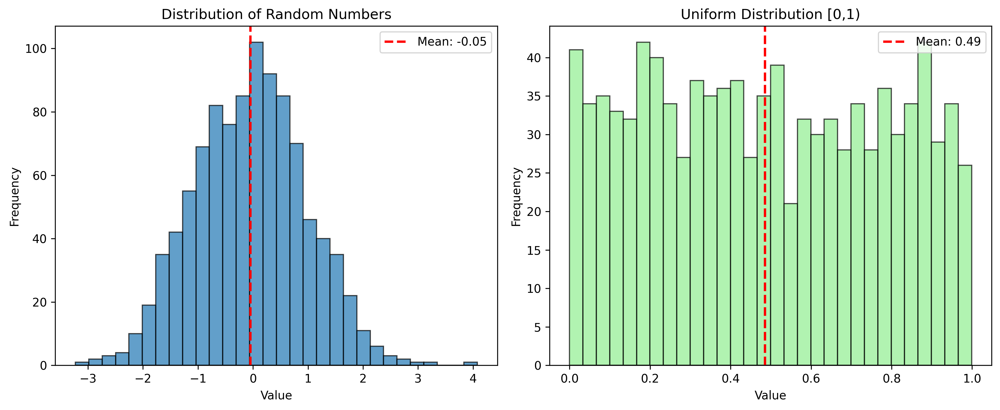

# 📘 Week 3 – Math Foundations (Linear Algebra + Statistics)

## 🔢 Project Overview
This project focuses on the **mathematical foundations** of machine learning using **NumPy**.  
The goal is to practice:
- **Matrix multiplication** (basis of neural networks)  
- **Vector operations**  
- **Statistical measures** (mean, variance, std dev)  
- **Data visualization** (normal vs uniform distributions)  

By the end, you’ll have a stronger grasp of the math that powers AI/ML.

---

## 🗂️ Dataset
- **Synthetic Data** generated using **NumPy**  
- Normal distribution (`np.random.randn`)  
- Uniform distribution (`np.random.rand`)  
- Random integers for matrix practice (`np.random.randint`)  

No external dataset was required.

---

## 🛠️ Key Steps
1. **Matrix Multiplication**
   - Practiced multiplying matrices with compatible dimensions.  
   - Verified shape rules: (m × n) × (n × p) → (m × p).  

2. **Vector Operations**
   - Element-wise operations (addition, subtraction, multiplication).  
   - Dot product.  
   - Normalization of vectors.  

3. **Statistics**
   - Manually computed mean, variance, and std dev.  
   - Compared manual results with NumPy’s built-in functions.  

4. **Visualizations**
   - Plotted histograms of:
     - Normal distribution (bell curve).  
     - Uniform distribution (flat distribution).  
   - Added vertical lines for the mean to interpret results.  

---

## 📊 Insights & Learnings
- **Matrix multiplication** underpins neural networks (weights × inputs).  
- **Statistics (mean, variance, std dev)** are critical for feature scaling and data preprocessing.  
- **Normal distribution** shows clustered data around the mean, while **uniform distribution** spreads values evenly.  
- Understanding distributions helps in **data analysis** and detecting anomalies.  

---

## 📷 Plots
Below is the comparison between a **Normal distribution** and a **Uniform distribution**:  

  

---

## 🛠️ Requirements
Install the following dependencies before running the notebook:  

```txt
numpy
matplotlib
